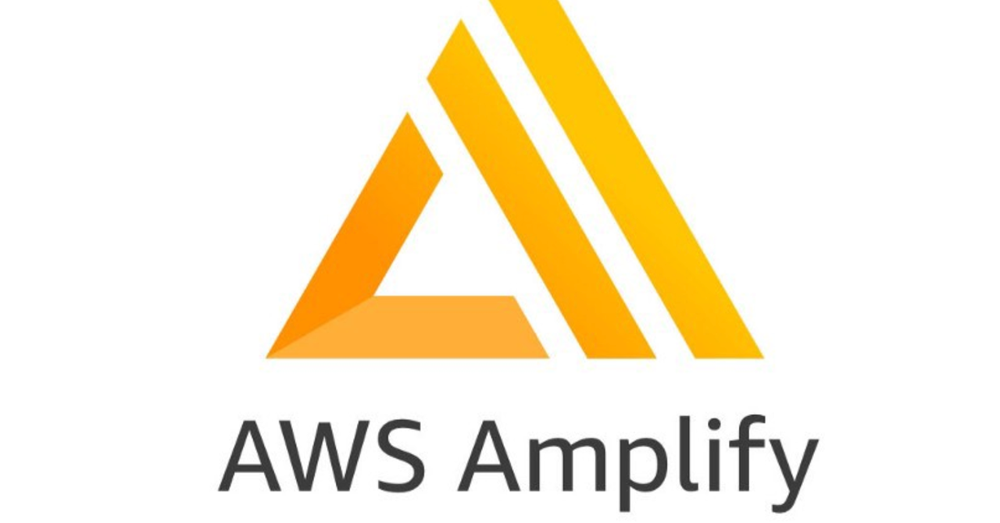
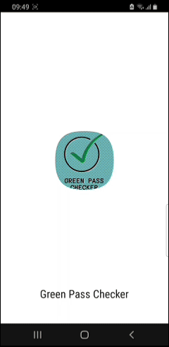

# Greenpass Checker PWA

## Introduction

Greenpasschecker is a React web application that scans and validates European COVID-19 Green Pass QR codes. It is designed to be fast, mobile-friendly, and easily deployable as a Progressive Web App (PWA).

## Description

Greenpasschecker is a React 18 application that uses `@zxing/library` for QR code scanning and Bootstrap 5 for the user interface. Built as a Progressive Web App (PWA), it allows users to scan and validate European COVID-19 Green Pass QR codes with a responsive, mobile-friendly design. The application features modular components including `QRScanner` and `ResultDisplay` for an intuitive user experience.

### Getting Started

1. Install dependencies: `npm install`
2. Start the dev server: `npm start` (opens at http://localhost:3000)
3. Build for production: `npm run build`

## Deploy

  

<a href="https://aws.amazon.com/amplify/" target="_blank" rel="noopener noreferrer">AWS Amplify</a> is a full-stack development platform for building secure, scalable mobile and web applications. It offers easy backend integration, hosting, and continuous deployment with a modern developer experience.   
Deploy using AWS Amplify Hosting. Steps (CI/CD with GitHub):

1. Push your code to the `main` branch on GitHub.
2. Open the AWS Amplify Console
3. Select “Host web app”, choose “GitHub”, and authorize access.
4. Pick the repository `PWA-greenpasschecker` and branch `main`.
5. Build settings: this repo includes `amplify.yml` which uses Node 20 and runs `npm ci` then `npm run build`.
6. Artifact output directory: `build`.
7. Start the deploy. After it completes, you will get a public URL.

## Result

<table>
  <tr>
    <td></td>
  </tr>
</table>

